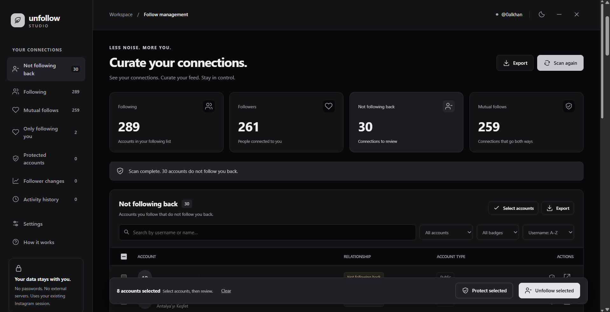
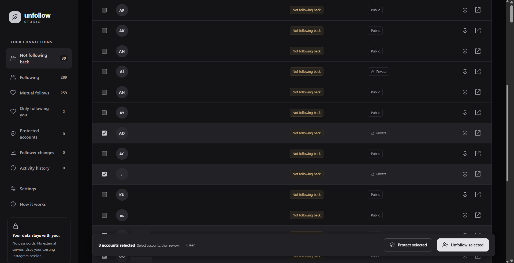
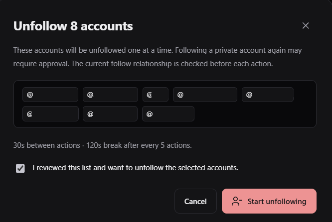
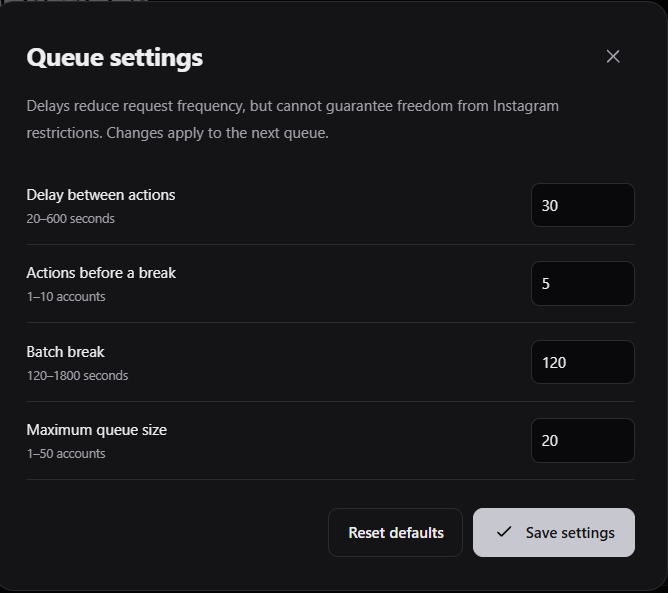

# Unfollow Studio

A local Instagram follow manager that runs in your browser console. Review connections, protect accounts and confirm each unfollow queue from one panel.

**Version 1.1.3** · No password collection · No external application server · No runtime dependencies

## Screenshots

### Dashboard

Following, followers, mutual connections and accounts that do not follow you back.



### Account selection

Review the list and use the selection bar to protect or unfollow selected accounts.



### Confirmation and queue settings

Every queue requires a reviewed list and explicit confirmation. Delays and queue size are configurable.

| Confirm the selected accounts | Configure the queue |
| --- | --- |
|  |  |

## Quick start

1. If an older panel is running, stop its queue and refresh the Instagram tab.
2. Sign in at [Instagram](https://www.instagram.com/).
3. Open [dist/instagram-unfollow.txt](dist/instagram-unfollow.txt) in a text editor and copy its entire contents. Inspect the code before running it.
4. Open **F12 → Console**, paste the script and press Enter. Follow your browser's paste protection instructions. The `.js` file is a browser script; do not double-click it as a Windows program.
5. Click **Scan my account** and wait for both following and follower lists to finish.
6. Review **Not following back**, protect accounts using the shield and select the accounts you want to manage.
7. Click **Unfollow selected**, review the exact list, tick the confirmation checkbox and start the queue.

Opening the panel sends no Instagram requests. It uses the signed-in account ID; a username or profile lookup is not required. Running the same version again reopens the panel.

**Offline demo:** download the repository and open [demo.html](demo.html) in a browser. It uses sample accounts and accelerated delays. The code button copies the production script; if clipboard access is unavailable, copy the `.txt` file instead.

## Features

- Following, nonfollowers, mutual follows and accounts that only follow you.
- Search, privacy and verification filters, sorting and pagination.
- Protected accounts with account-specific JSON backup and restore.
- CSV/JSON export, username copying and comparisons between completed scans.
- Activity history, confirmation, pause, resume, stop and batch breaks.
- Light and dark themes.

Only accounts that do not follow you back are eligible. The relationship is checked again before every unfollow; accounts that now follow you, are already unfollowed or have been protected are skipped. An ambiguous POST result is never automatically retried or recorded as successful.

| Queue setting | Default | Range |
| --- | --- | --- |
| Delay between actions | 30 seconds | 20–600 seconds |
| Actions before a break | 5 | 1–10 |
| Batch break | 120 seconds | 120–1800 seconds |
| Maximum queue size | 20 | 1–50 |

A new complete scan is required after opening the panel. Scans expire after 30 minutes. Web Locks prevent competing scans or queues for the same account across tabs. Closing the tab stops the queue but cannot undo a request already sent.

## Privacy and limitations

Live mode runs only on HTTPS `instagram.com` or `www.instagram.com`. Requests use an allowlist of relative Instagram paths, keep credentials on the same origin and refuse redirects. Passwords, session cookies and CSRF values are not saved or exported. No external fonts, analytics or code CDN are used.

Snapshots are stored in the `insta-unfollow-studio` IndexedDB database. Settings, protected accounts and activity history use `insta-unfollow-studio:v2:<accountId>` in localStorage. **These records are not encrypted; other scripts on the Instagram origin can read them.** Exported files contain account information and should remain private.

Instagram can restrict requests or require verification. List requests receiving HTTP 429 can retry the same page up to three times after 30, 60 and 90 seconds, respecting a longer `Retry-After` value. Authentication errors, challenges, relationship checks and unfollow POSTs are not automatically retried. Incomplete or contradictory pagination leaves actions disabled unless a separate read-only pass completes successfully.

Delays cannot guarantee freedom from account restrictions. The tool uses undocumented Instagram endpoints, which can change. Missing followers may reflect deactivation or blocking. Compatibility with a real signed-in account is not guaranteed.

This is an unofficial project and is not affiliated with Instagram or Meta. See the [Instagram Terms of Use](https://help.instagram.com/termsofuse), [security policy](.github/SECURITY.md) and [security review](docs/SECURITY_REVIEW.md).

## Development

Use **Node.js 22.13+**. Building and serving the demo use Node.js built-ins. Lint uses development dependencies from the lockfile.

```sh
npm ci --ignore-scripts
npm run lint
npm run build
npm run build:check
npm audit
npm start
```

On Windows PowerShell, use `npm.cmd` if execution policy blocks the PowerShell wrapper.

`npm start` serves the demo at [127.0.0.1:4173](http://127.0.0.1:4173), bound to loopback. It serves only the demo and generated scripts. Rebuild after source edits and include the three generated files in your commit. `build:check` fails when generated files differ from the source.

GitHub Actions runs lint, bundle verification and dependency auditing on Node.js 22 and 24. Dependabot checks development packages and Actions weekly.

| Path | Purpose |
| --- | --- |
| `dist/instagram-unfollow.txt` | Copy/paste production script |
| `dist/instagram-unfollow.js` | Identical JavaScript bundle |
| `demo.html` | Standalone offline demo |
| `src/core.mjs` | Validation, filtering, exports and queue |
| `src/instagram.mjs` | Session checks, pagination and request handling |
| `src/storage.mjs` | Snapshot persistence |
| `src/ui.mjs`, `src/styles.css` | Shadow DOM interface and themes |
| `docs/screenshots/` | README screenshots |


See the [changelog](CHANGELOG.md) for the complete release history.

For contributions and support, see [CONTRIBUTING](.github/CONTRIBUTING.md), [SUPPORT](.github/SUPPORT.md) and [CODE_OF_CONDUCT](.github/CODE_OF_CONDUCT.md).
